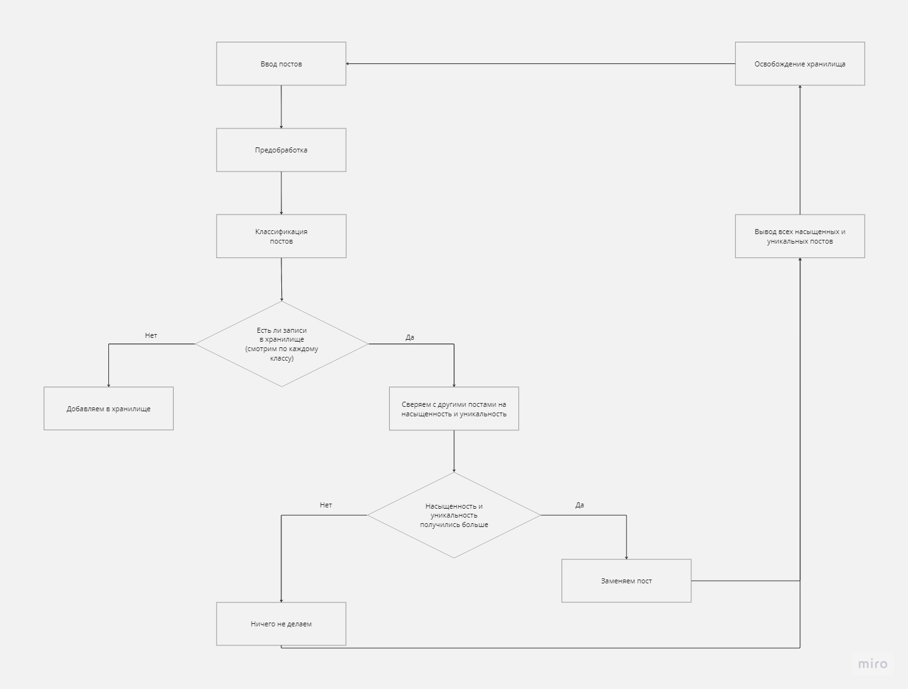
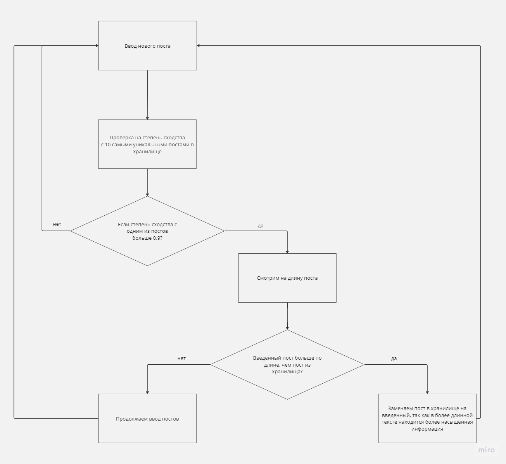

# ai_news
ИИ-микросервис, который будет удалять дубликаты новостей
из фиксированного набора и классифицировать новости по заранее
известным категориям. В случае идентичной тематики в дублях
будет выбираться та, которая более насыщена целевой информацией.
 
# Установка и использование
Используется python3.10
- git clone https://git.codenrock.com/ai-news-hack/cnrprod-team-54728/news-classification
- python -m venv venv
- .\venv\Scripts\activate
- uvicorn app.main:app --reload
 
Если приложение крашится в конце, попробуйте запустить launch_pipeline() в ai_news_classification.pipeline.py
 
Докер не получилось использовать
 
 
# Pipeline
 

 
 
# Обновление хранилища

 
## !!! При неудачном запуске приложения обращаться к нам для устранения проблем. !!!